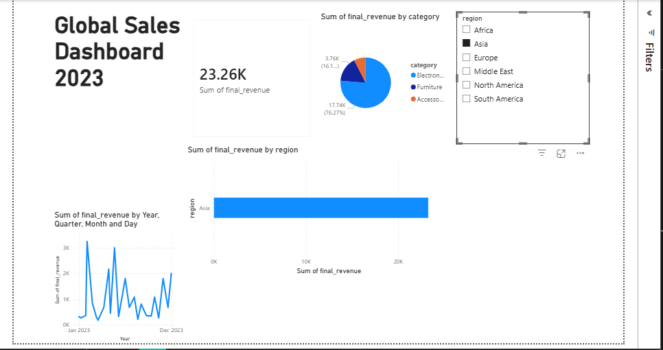

# 🌍 Global Sales Data Analysis

A complete data analysis project that explores global sales data using **Python, Pandas, and Power BI**.
The project focuses on **data cleaning, exploratory analysis, and dashboard visualization** to extract meaningful business insights.

---

# 📌 Project Overview

Businesses generate huge amounts of sales data. However, raw data is often messy and difficult to analyze directly.

In this project, the dataset was cleaned and analyzed using **Python**, and the results were visualized through a **Power BI dashboard** to uncover trends in global sales performance.

This project demonstrates practical skills in:

* Data Cleaning
* Data Analysis
* Data Visualization
* Dashboard Building
* Data-driven decision making

---

# 🛠 Tools & Technologies

| Tool             | Purpose                          |
| ---------------- | -------------------------------- |
| Python           | Data processing and analysis     |
| Pandas           | Data cleaning and transformation |
| Jupyter Notebook | Analysis environment             |
| Power BI         | Interactive dashboard            |
| GitHub           | Project version control          |

---

# 📂 Project Structure

```
global-sales-analysis
│
├── DATA
│   └── Global_sales.csv
│
├── CLEANED
│   └── global_sales_cleaned.csv
│
├── NOTEBOOK
│   └── global_sales.ipynb
│
├── DASHBOARD
│   └── Global Sales Dashboard 2023.pbix
│
├── IMAGES
│   └── OUTPUT.PNG
│
└── README.md
```

### Folder Explanation

**DATA**
Contains the original raw dataset used for analysis.

**CLEANED**
Processed and cleaned dataset after handling missing values and formatting.

**NOTEBOOK**
Python notebook used for:

* Data cleaning
* Data transformation
* Exploratory data analysis

**DASHBOARD**
Power BI file used to build the interactive sales dashboard.

**IMAGES**
Preview images of the dashboard for quick viewing.

---

# 🔎 Data Cleaning Process

The dataset required several preprocessing steps before analysis:

### Steps performed

1. Removed duplicate rows
2. Handled missing values
3. Standardized column names
4. Converted data types
5. Cleaned inconsistent values
6. Prepared dataset for analysis

Python libraries used:

```
pandas
numpy
matplotlib
```

---

# 📊 Exploratory Data Analysis

After cleaning the dataset, the following analysis was performed:

* Total global sales analysis
* Sales by region
* Sales by category
* Sales trends
* Top performing markets

This helped identify **key business insights and sales patterns**.

---

# 📈 Dashboard

A **Power BI dashboard** was created to visualize the results of the analysis.

Dashboard features:

* Global sales overview
* Sales by region
* Category performance
* Interactive filtering
* Trend analysis

### Dashboard Preview



---

# 🚀 How to Run This Project

### 1️⃣ Clone the repository

```
git clone https://github.com/your-username/global-sales-analysis.git
```

### 2️⃣ Install required libraries

```
pip install pandas numpy matplotlib jupyter
```

### 3️⃣ Run the notebook

```
jupyter notebook
```

Open:

```
NOTEBOOK/global_sales.ipynb
```

---

# 💡 Key Insights

Some insights discovered from the analysis include:

* Certain regions contribute the majority of global sales.
* Some product categories outperform others consistently.
* Sales trends reveal seasonal demand patterns.

These insights can help businesses make **data-driven decisions**.

---

# 📌 Future Improvements

Possible improvements for this project:

* Add machine learning prediction model
* Deploy dashboard online
* Build a Streamlit web application
* Automate data pipeline

---

# 👨‍💻 Author

**Vicky**

Python Developer | Data Analytics | Full Stack (Python)

GitHub:
https://github.com/your-username

---

⭐ If you found this project useful, consider giving it a star!
